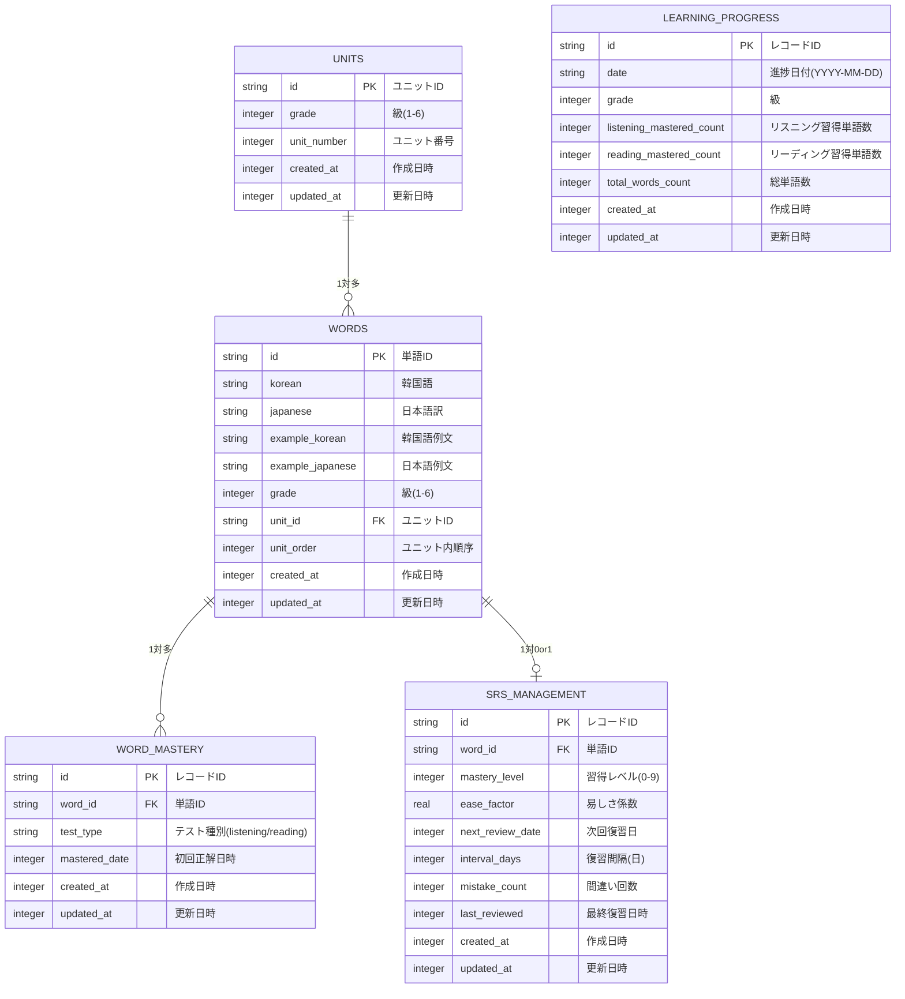

# データベース設計

## 概要
TOPIK道場アプリのSQLiteデータベース設計

**重要**: このデータベースはクライアント（アプリ）内蔵型です。サーバーレス構成のため、全データはアプリに内蔵されたSQLiteデータベースで管理されます。

**ORM**: WatermelonDB を使用して大量データ（12,000語）の高速処理とReact Nativeでの最適なパフォーマンスを実現します。WatermelonDBは内部でSQLiteを使用するため、基本的なテーブル設計・ER図を活用できます。

**WatermelonDB実装パターン**:
- **主キー**: すべてのテーブルで自動生成される`id`（TEXT型）を使用
- **外部キー**: `word_id`等の参照フィールドもTEXT型で統一
- **日時データ**: DATETIMEではなくUnixTimestamp（INTEGER型）で保存
- **1:1関係**: 外部キーフィールド + `@relation`デコレータで実装
- **自動フィールド**: `created_at`, `updated_at`は全テーブルで自動管理

**パフォーマンス最適化**: 現在はパフォーマンス最適化（インデックス追加等）は考慮しない。基本的なDB設計のみを行い、必要に応じて後から最適化を検討する。

## ユースケース

### 統合ユースケース

#### 1. SRS復習システム
**機能概要:** 簡易SRSアルゴリズムによる復習管理  
**関連画面:** 01-top.md（復習対象数表示）, 11-review.md（SRS実行・更新）  
**データ操作:**
- 読み取り: 本日復習すべき単語数の算出
- 読み取り: 復習対象単語の一覧取得
- 読み取り: 各単語のSRS管理データ取得
- 書き込み: SRS管理データの更新（習得レベル・次回復習日・間違い回数など）
- 書き込み: 復習セッション履歴の記録

#### 2. 語彙データ管理
**機能概要:** 12,000語の語彙データの管理・取得  
**関連画面:** 03-unit-selection.md（ユニット構成取得）, 05-listening-unit-selection.md（ユニット構成取得）, 06-reading-unit-selection.md（ユニット構成取得）, 07-learning.md（単語詳細データ取得）, 08-listening-test.md（テスト用単語データ・選択肢生成）, 09-reading-test.md（テスト用単語データ・選択肢生成）, 11-review.md（復習用単語詳細データ取得）  
**データ操作:**
- 読み取り: 各級のユニット数・構成情報の取得
- 読み取り: 指定ユニットの単語詳細データ（韓国語・日本語・例文・音声ファイル情報）
- 読み取り: 間違い選択肢生成用の同級語彙データ取得（ランダム）
- 読み取り: 級別総語彙数取得（進捗率計算用）

#### 3. 語彙習得管理
**機能概要:** テスト正解による語彙習得状態の記録・統計  
**関連画面:** 08-listening-test.md（テスト正解時の習得記録）, 09-reading-test.md（テスト正解時の習得記録）, 10-results.md（習得率統計表示）  
**データ操作:**
- 書き込み: テスト正解時の語彙習得記録（テスト種別・習得日時）
- 読み取り: 指定級の語彙習得状況取得（リスニング/リーディング別）
- 書き込み: 日毎習得率スナップショットの保存（updateOrCreate方式）
- 読み取り: 習得率統計データの取得

## ER図



## テーブル設計

### 1. UNITS（ユニットマスターテーブル）
語彙学習の単位となるユニット情報を管理する新設テーブル

```sql
CREATE TABLE units (
    id TEXT PRIMARY KEY,                -- ユニットID（WatermelonDB自動生成）
    grade INTEGER NOT NULL,             -- 級（1-6）
    unit_number INTEGER NOT NULL,       -- 級内ユニット番号（1から開始）
    created_at INTEGER NOT NULL,        -- 作成日時（UnixTimestamp）
    updated_at INTEGER NOT NULL         -- 更新日時（UnixTimestamp）
);
```

**表示名計算:**
- ユニット表示名: `{(unit_number-1)*10+1}-{unit_number*10}` 
- 例：unit_number=3 → "21-30"

**データ例:**
- id="unit_1_1", grade=1, unit_number=1 → 表示名"1-10"
- id="unit_3_25", grade=3, unit_number=25 → 表示名"241-250"

### 2. WORDS（語彙マスターテーブル）
全12,000語の語彙データを格納する中核テーブル

**音声ファイル**: DBに保存せず、一定のルールで命名・読み込み
- 単語音声: `audio/words/{id}.mp3`
- 例文音声: `audio/examples/{id}.mp3`

```sql
CREATE TABLE words (
    id TEXT PRIMARY KEY,                -- 単語ID（WatermelonDB自動生成）
    korean TEXT NOT NULL,               -- 韓国語単語
    japanese TEXT NOT NULL,             -- 日本語訳
    example_korean TEXT,                -- 韓国語例文
    example_japanese TEXT,              -- 日本語例文
    grade INTEGER NOT NULL,             -- 級（1-6）
    unit_id TEXT NOT NULL,              -- ユニットID（外部キー）
    unit_order INTEGER NOT NULL,        -- ユニット内順序（1-10）
    created_at INTEGER NOT NULL,        -- 作成日時（UnixTimestamp）
    updated_at INTEGER NOT NULL,        -- 更新日時（UnixTimestamp）
    FOREIGN KEY (unit_id) REFERENCES units(id)
);
```

**データ例:**
- id="word_001", grade=1, unit_id="unit_1_1", unit_order=1 
- id="word_010", grade=1, unit_id="unit_1_1", unit_order=10
- id="word_011", grade=1, unit_id="unit_1_2", unit_order=1

### 3. SRS_MANAGEMENT（SRS管理テーブル）
各単語のSRS（間隔反復学習）データを管理

```sql
CREATE TABLE srs_management (
    id TEXT PRIMARY KEY,                -- レコードID（WatermelonDB自動生成）
    word_id TEXT NOT NULL,              -- 単語ID（外部キー）
    mastery_level INTEGER DEFAULT 0,    -- 習得レベル（0-9: 0-8=復習対象, 9=習得完了）
    ease_factor REAL DEFAULT 2.5,      -- 易しさ係数（1.3-4.0, デフォルト2.5）
    next_review_date INTEGER,           -- 次回復習日（UnixTimestamp）
    interval_days INTEGER DEFAULT 1,    -- 復習間隔（日数）
    mistake_count INTEGER DEFAULT 0,    -- 間違い回数
    last_reviewed INTEGER,              -- 最終復習日時（UnixTimestamp）
    created_at INTEGER NOT NULL,        -- 作成日時（UnixTimestamp）
    updated_at INTEGER NOT NULL,        -- 更新日時（UnixTimestamp）
    FOREIGN KEY (word_id) REFERENCES words(id)
);
```

**SRS詳細仕様**: [SRSシステム仕様書](./srs-system.md)を参照

### 4. WORD_MASTERY（語彙習得管理テーブル）
テスト正解による語彙習得状態を管理

```sql
CREATE TABLE word_mastery (
    id TEXT PRIMARY KEY,                -- レコードID（WatermelonDB自動生成）
    word_id TEXT NOT NULL,              -- 単語ID（外部キー）
    test_type TEXT NOT NULL,            -- テスト種別（listening/reading）
    mastered_date INTEGER NOT NULL,     -- 初回正解日時（UnixTimestamp）
    created_at INTEGER NOT NULL,        -- 作成日時（UnixTimestamp）
    updated_at INTEGER NOT NULL,        -- 更新日時（UnixTimestamp）
    FOREIGN KEY (word_id) REFERENCES words(id),
    UNIQUE(word_id, test_type)          -- 単語×テスト種別でユニーク
);
```

**用途**: 
- テスト正解時に単語の習得状態を記録
- 一度正解した単語は「習得済み」として永続化
- リスニング/リーディング別に管理

### 5. LEARNING_PROGRESS（学習進捗テーブル）
日別・級別の語彙習得進捗スナップショットを保存

```sql
CREATE TABLE learning_progress (
    id TEXT PRIMARY KEY,                -- レコードID（WatermelonDB自動生成）
    date TEXT NOT NULL,                 -- 進捗日付（YYYY-MM-DD）
    grade INTEGER NOT NULL,             -- 級（1-6）
    listening_mastered_count INTEGER NOT NULL, -- リスニング習得単語数
    reading_mastered_count INTEGER NOT NULL,   -- リーディング習得単語数
    total_words_count INTEGER NOT NULL, -- その級の総単語数
    created_at INTEGER NOT NULL,        -- 作成日時（UnixTimestamp）
    updated_at INTEGER NOT NULL,        -- 更新日時（UnixTimestamp）
    UNIQUE(date, grade)                 -- 日付+級の組み合わせでユニーク
);
```

**更新方式**: 
- テスト完了時にupdateOrCreate方式で更新
- 同日は既存レコードを上書き


## 設計の考慮点

### データ整合性
- **外部キー制約**: 参照整合性を保証
- **UNIQUE制約**: 重複防止（learning_progressの日付+級など）
- **CHECK制約**: 値の妥当性確保（gradeは1-6、mastery_levelは0-5など）

### スケーラビリティ
- **INTEGER主キー**: 高速アクセスと省容量
- **タイムスタンプ**: 作成日時・更新日時を記録してデータ追跡可能
- **論理削除**: 物理削除ではなく論理削除でデータ履歴保持

### クエリ例

#### 1. 本日の復習対象取得
```sql
SELECT w.*, s.mastery_level, s.mistake_count
FROM words w
JOIN srs_management s ON w.id = s.word_id
WHERE s.next_review_date <= strftime('%s', 'now') * 1000
  AND s.mastery_level < 9
ORDER BY s.next_review_date ASC, s.mistake_count DESC
LIMIT 50;
```

#### 2. 語彙習得状況取得（リスニング/リーディング別）
```sql
-- 3級のリスニング習得単語数
SELECT COUNT(*) as listening_mastered
FROM word_mastery wm
JOIN words w ON wm.word_id = w.id
WHERE w.grade = 3 AND wm.test_type = 'listening';

-- 3級のリーディング習得単語数
SELECT COUNT(*) as reading_mastered
FROM word_mastery wm
JOIN words w ON wm.word_id = w.id
WHERE w.grade = 3 AND wm.test_type = 'reading';
```

#### 3. 学習進捗履歴取得
```sql
SELECT 
    date,
    listening_mastered_count,
    reading_mastered_count,
    total_words_count
FROM learning_progress
WHERE grade = 3
ORDER BY date DESC;
```

#### 4. ユニット一覧取得
```sql
-- 指定級のユニット一覧を取得
SELECT *
FROM units
WHERE grade = 3
ORDER BY unit_number;
```

#### 5. ユニット単語取得
```sql
-- 指定ユニットの単語を取得
SELECT w.*, u.unit_number
FROM words w
JOIN units u ON w.unit_id = u.id
WHERE u.id = 'unit_3_1'
ORDER BY w.unit_order;
```

#### 6. 間違い選択肢生成（同級ランダム）
```sql
-- 正解単語以外の同級単語からランダムで3つ選択
SELECT japanese
FROM words
WHERE grade = 3
  AND id != 'word_123'  -- 正解単語のid
ORDER BY RANDOM()
LIMIT 3;
```

---
*作成日: 2025/6/13*