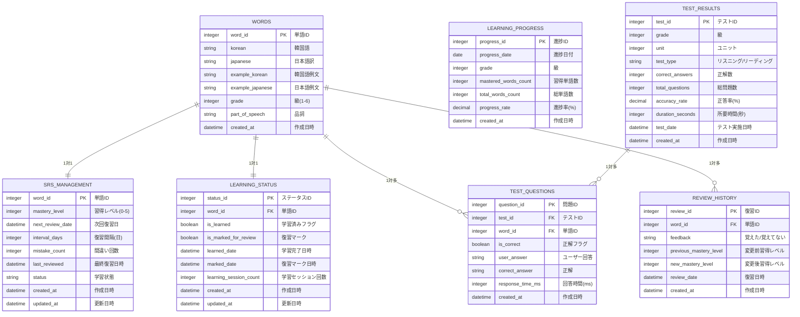

# データベース設計

## 概要
TOPIK道場アプリのSQLiteデータベース設計

**重要**: このデータベースはクライアント（アプリ）内蔵型です。サーバーレス構成のため、全データはアプリに内蔵されたSQLiteデータベースで管理されます。

## ユースケース

### 統合ユースケース

#### 1. SRS復習システム
**機能概要:** 簡易SRSアルゴリズムによる復習管理  
**関連画面:** 01-top.md（復習対象数表示）, 11-review.md（SRS実行・更新）  
**データ操作:**
- 読み取り: 本日復習すべき単語数の算出
- 読み取り: 復習対象単語の一覧取得
- 読み取り: 各単語のSRS管理データ取得
- 書き込み: SRS管理データの更新（習得レベル・次回復習日・間違い回数など）
- 書き込み: 復習セッション履歴の記録

#### 2. 語彙データ管理
**機能概要:** 12,000語の語彙データの管理・取得  
**関連画面:** 03-unit-selection.md（ユニット構成取得）, 05-listening-unit-selection.md（ユニット構成取得）, 06-reading-unit-selection.md（ユニット構成取得）, 07-learning.md（単語詳細データ取得）, 08-listening-test.md（テスト用単語データ・選択肢生成）, 09-reading-test.md（テスト用単語データ・選択肢生成）, 11-review.md（復習用単語詳細データ取得）  
**データ操作:**
- 読み取り: 各級のユニット数・構成情報の取得
- 読み取り: 指定ユニットの単語詳細データ（韓国語・日本語・例文・音声ファイル情報）
- 読み取り: 間違い選択肢生成用の同級語彙データ取得（ランダム）
- 読み取り: 級別総語彙数取得（進捗率計算用）

#### 3. 学習進捗管理
**機能概要:** ユーザーの学習状況・テスト結果の記録  
**関連画面:** 07-learning.md（学習進捗記録・取得）, 11-review.md（学習進捗履歴更新）  
**データ操作:**
- 読み取り: ユーザーの学習進捗状況取得
- 書き込み: 学習完了状況の保存
- 書き込み: 復習マークされた単語の記録
- 書き込み: 学習履歴の記録
- 書き込み: 学習進捗履歴の更新（日別・級別）

#### 4. テスト結果管理
**機能概要:** リスニング・リーディングテストの結果記録・統計  
**関連画面:** 08-listening-test.md（リスニングテスト結果記録）, 09-reading-test.md（リーディングテスト結果記録）, 10-results.md（テスト結果統計表示）  
**データ操作:**
- 書き込み: テスト結果（問題別詳細 + 全体スコア）の保存
- 書き込み: テスト履歴（日時、スコア、所要時間）の記録
- 書き込み: 間違えた問題の記録（復習用）
- 読み取り: 指定級の全テスト結果データ取得
- 読み取り: テスト結果履歴データの取得
- 書き込み: 進捗スナップショットの保存
- 読み取り: 進捗スナップショットの取得

## ER図



## テーブル設計

### 1. WORDS（語彙マスターテーブル）
全12,000語の語彙データを格納する中核テーブル

**音声ファイル**: DBに保存せず、一定のルールで命名・読み込み
- 単語音声: `audio/words/{word_id}.mp3`
- 例文音声: `audio/examples/{word_id}.mp3`

```sql
CREATE TABLE words (
    word_id INTEGER PRIMARY KEY,        -- 単語ID（1-12000の連番）
    korean TEXT NOT NULL,               -- 韓国語単語
    japanese TEXT NOT NULL,             -- 日本語訳
    example_korean TEXT,                -- 韓国語例文
    example_japanese TEXT,              -- 日本語例文
    grade INTEGER NOT NULL,             -- 級（1-6）
    part_of_speech TEXT,                -- 品詞（名詞、動詞等）
    created_at DATETIME DEFAULT CURRENT_TIMESTAMP
);
```

**ユニット計算式:**
- `unit = CEIL(word_id / 10)` （例：word_id=25 → unit=3）
- `unit_position = ((word_id - 1) % 10) + 1` （例：word_id=25 → 5番目）

### 2. SRS_MANAGEMENT（SRS管理テーブル）
各単語のSRS（間隔反復学習）データを管理

```sql
CREATE TABLE srs_management (
    word_id INTEGER PRIMARY KEY,        -- 単語ID（外部キー）
    mastery_level INTEGER DEFAULT 0,    -- 習得レベル（0-5）
    next_review_date DATETIME,          -- 次回復習日
    interval_days INTEGER DEFAULT 1,    -- 復習間隔（日数）
    mistake_count INTEGER DEFAULT 0,    -- 間違い回数
    last_reviewed DATETIME,             -- 最終復習日時
    status TEXT DEFAULT 'learning',     -- 学習状態（learning/mastered）
    created_at DATETIME DEFAULT CURRENT_TIMESTAMP,
    updated_at DATETIME DEFAULT CURRENT_TIMESTAMP,
    FOREIGN KEY (word_id) REFERENCES words(word_id)
);
```

### 3. LEARNING_PROGRESS（学習進捗テーブル）
日別・級別の学習進捗スナップショットを保存

```sql
CREATE TABLE learning_progress (
    progress_id INTEGER PRIMARY KEY AUTOINCREMENT,  -- 進捗ID（自動増分）
    progress_date DATE NOT NULL,        -- 進捗記録日
    grade INTEGER NOT NULL,             -- 級（1-6）
    mastered_words_count INTEGER DEFAULT 0,  -- 習得済み単語数
    total_words_count INTEGER NOT NULL, -- その級の総単語数
    progress_rate DECIMAL(5,2) DEFAULT 0,    -- 進捗率（%）
    created_at DATETIME DEFAULT CURRENT_TIMESTAMP,
    UNIQUE(progress_date, grade)        -- 日付+級の組み合わせでユニーク
);
```

### 4. TEST_RESULTS（テスト結果テーブル）
テストセッションの全体結果を記録

```sql
CREATE TABLE test_results (
    test_id INTEGER PRIMARY KEY AUTOINCREMENT,  -- テストID（自動増分）
    grade INTEGER NOT NULL,             -- 級
    unit INTEGER NOT NULL,              -- ユニット
    test_type TEXT NOT NULL,            -- テスト種別（listening/reading）
    correct_answers INTEGER NOT NULL,   -- 正解数
    total_questions INTEGER NOT NULL,   -- 総問題数
    accuracy_rate DECIMAL(5,2),         -- 正答率（%）
    duration_seconds INTEGER,           -- 所要時間（秒）
    test_date DATETIME NOT NULL,        -- テスト実施日時
    created_at DATETIME DEFAULT CURRENT_TIMESTAMP
);
```

### 5. TEST_QUESTIONS（テスト問題詳細テーブル）
テスト内の各問題の詳細結果を記録

```sql
CREATE TABLE test_questions (
    question_id INTEGER PRIMARY KEY AUTOINCREMENT,  -- 問題ID（自動増分）
    test_id INTEGER NOT NULL,           -- テストID（外部キー）
    word_id INTEGER NOT NULL,           -- 単語ID（外部キー）
    is_correct BOOLEAN NOT NULL,        -- 正解フラグ
    user_answer TEXT,                   -- ユーザーの回答
    correct_answer TEXT NOT NULL,       -- 正解
    response_time_ms INTEGER,           -- 回答時間（ミリ秒）
    created_at DATETIME DEFAULT CURRENT_TIMESTAMP,
    FOREIGN KEY (test_id) REFERENCES test_results(test_id),
    FOREIGN KEY (word_id) REFERENCES words(word_id)
);
```

### 6. REVIEW_HISTORY（復習履歴テーブル）
復習セッションでの個別単語フィードバックを記録

```sql
CREATE TABLE review_history (
    review_id INTEGER PRIMARY KEY AUTOINCREMENT,  -- 復習ID（自動増分）
    word_id INTEGER NOT NULL,           -- 単語ID（外部キー）
    feedback TEXT NOT NULL,             -- フィードバック（remembered/forgotten）
    previous_mastery_level INTEGER,     -- 変更前習得レベル
    new_mastery_level INTEGER,          -- 変更後習得レベル
    review_date DATETIME NOT NULL,      -- 復習実施日時
    created_at DATETIME DEFAULT CURRENT_TIMESTAMP,
    FOREIGN KEY (word_id) REFERENCES words(word_id)
);
```

### 7. LEARNING_STATUS（学習状況テーブル）
学習画面での単語別学習状況を管理

```sql
CREATE TABLE learning_status (
    word_id INTEGER PRIMARY KEY,        -- 単語ID（主キー兼外部キー）
    is_learned BOOLEAN DEFAULT FALSE,   -- 学習済みフラグ
    is_marked_for_review BOOLEAN DEFAULT FALSE,  -- 復習マーク
    learned_date DATETIME,              -- 学習完了日時
    marked_date DATETIME,               -- 復習マーク日時
    learning_session_count INTEGER DEFAULT 0,  -- 学習セッション回数
    created_at DATETIME DEFAULT CURRENT_TIMESTAMP,
    updated_at DATETIME DEFAULT CURRENT_TIMESTAMP,
    FOREIGN KEY (word_id) REFERENCES words(word_id)
);
```


## 設計の考慮点

### データ整合性
- **外部キー制約**: 参照整合性を保証
- **UNIQUE制約**: 重複防止（learning_progressの日付+級など）
- **CHECK制約**: 値の妥当性確保（gradeは1-6、mastery_levelは0-5など）

### スケーラビリティ
- **INTEGER主キー**: 高速アクセスと省容量
- **タイムスタンプ**: 作成日時・更新日時を記録してデータ追跡可能
- **論理削除**: 物理削除ではなく論理削除でデータ履歴保持

### クエリ例

#### 1. 本日の復習対象取得
```sql
SELECT w.*, s.mastery_level, s.mistake_count
FROM words w
JOIN srs_management s ON w.word_id = s.word_id
WHERE s.next_review_date <= DATE('now')
  AND s.status = 'learning'
ORDER BY s.next_review_date ASC, s.mistake_count DESC
LIMIT 50;
```

#### 2. 級別進捗率取得
```sql
SELECT 
    progress_date,
    progress_rate,
    mastered_words_count,
    total_words_count
FROM learning_progress
WHERE grade = 3
ORDER BY progress_date DESC
LIMIT 30;
```

#### 3. テスト結果統計
```sql
SELECT 
    test_type,
    AVG(accuracy_rate) as avg_accuracy,
    COUNT(*) as test_count
FROM test_results
WHERE grade = 3
  AND test_date >= DATE('now', '-30 days')
GROUP BY test_type;
```

#### 4. ユニット単語取得
```sql
-- 指定ユニットの単語を取得（word_idの範囲で計算）
SELECT *
FROM words
WHERE word_id BETWEEN (3-1)*10+1 AND 3*10  -- ユニット3の例：21-30
  AND grade = 3
ORDER BY word_id;
```

#### 5. 復習マーク単語抽出
```sql
SELECT w.*, ls.marked_date
FROM words w
JOIN learning_status ls ON w.word_id = ls.word_id
WHERE ls.is_marked_for_review = TRUE
  AND w.grade = 3
ORDER BY ls.marked_date ASC;
```

#### 6. 間違い選択肢生成（同級ランダム）
```sql
-- 正解単語以外の同級単語からランダムで3つ選択
SELECT japanese
FROM words
WHERE grade = 3
  AND word_id != 123  -- 正解単語のword_id
ORDER BY RANDOM()
LIMIT 3;
```

---
*作成日: 2025/6/13*