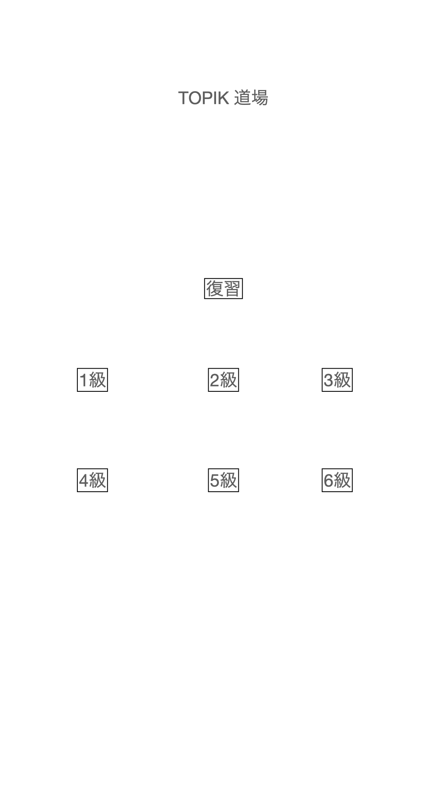
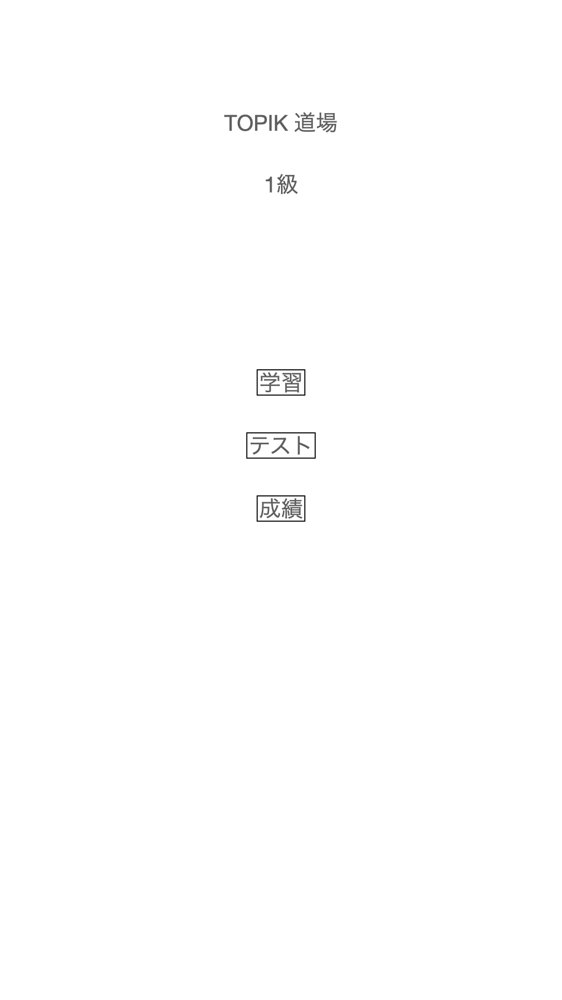
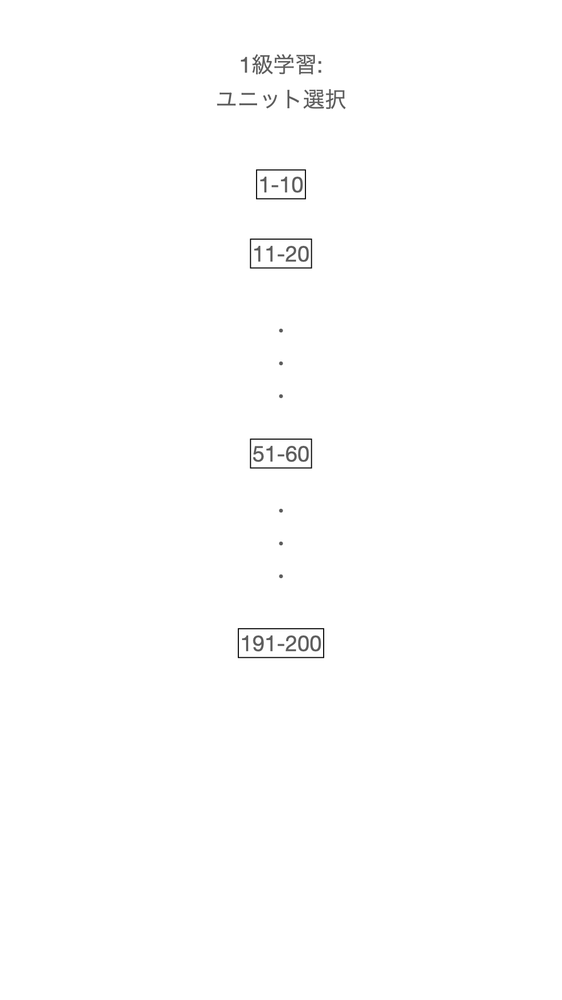
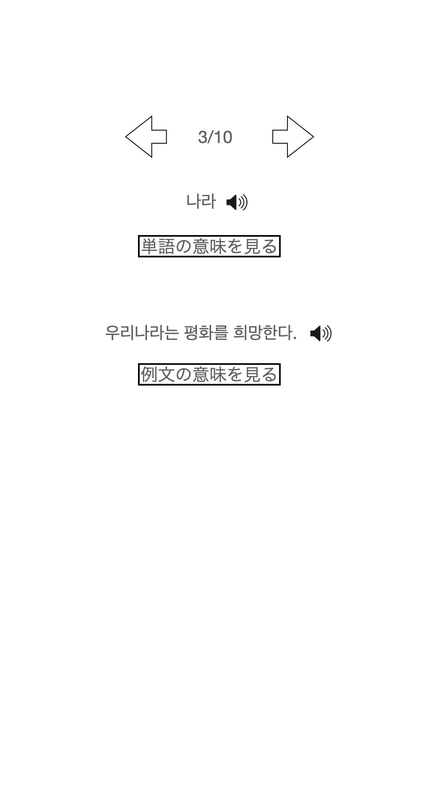
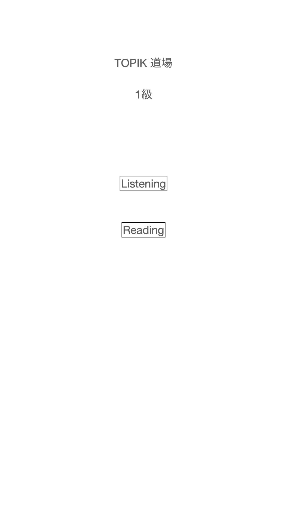
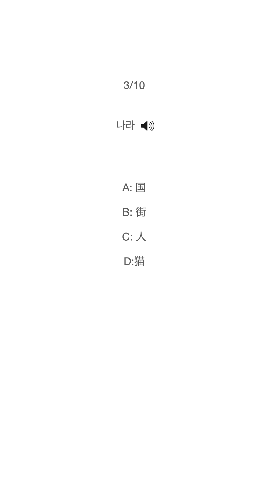
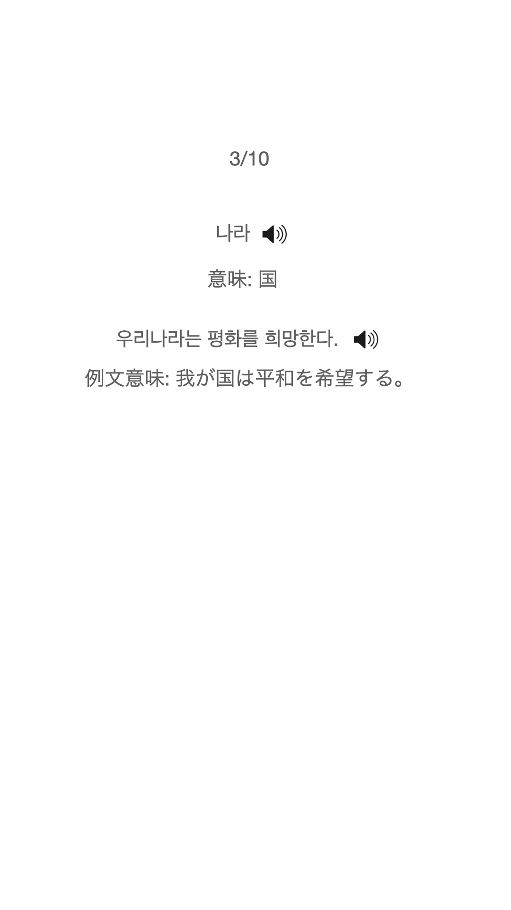
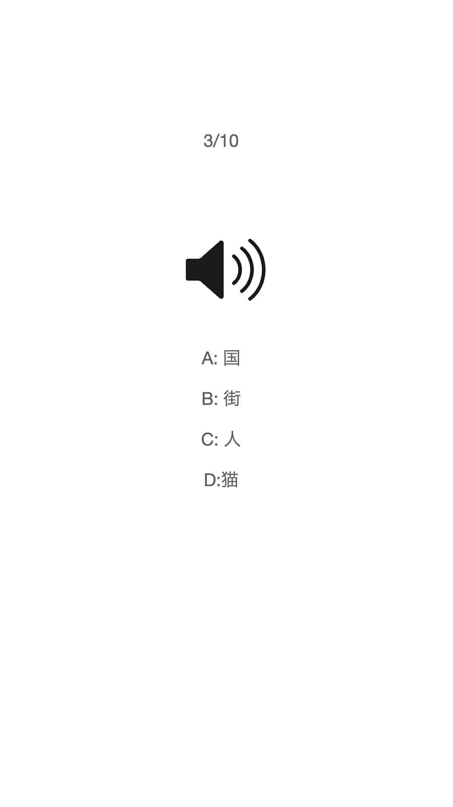
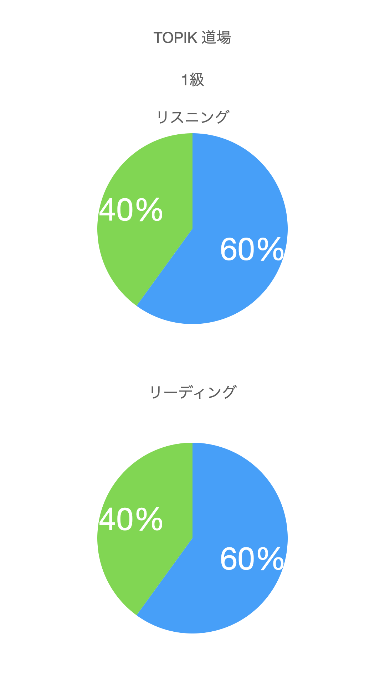

## ざっくり仕様

- 単語の範囲
  - TOPIK全級対象で、レベル別に分かれている
  - それぞれの試験を受けるにあたって、このアプリの該当級の語彙さえ抑えておけば合格ラインにいけるような語彙数を収録したい
- アプリのモード
  - 学習モード
    - 10問で1ユニットとして区切る
      - 1単語ずつカードのように表示される
        - 内容:
          - 韓国語単語（ハングル表記のみ。日本語のフリガナはなし）
          - 日本語訳（タップで見えるようになる）
          - 韓国語単語音声
          - 韓国語例文（ハングル表記のみ。日本語のフリガナはなし）
          - 例文日本語訳（タップで見えるようになる）
          - 韓国語例文音声
    - 各ユニットは、特定の近いジャンルの単語で固めないようにばらつかせる
      - 意図: 「食べ物」とか「挨拶」のようにジャンルを固めてしまうと、学習のフェーズによって知識がいびつに偏ってしまうため、なるべく常に満遍ないジャンルの語彙の学習が進めるようにしたい
  - テストモード
  - 復習モード
    - 有名なAnkiアプリのように、忘却曲線に沿ったふさわしいタイミングで、以下の条件(OR)の単語を出題してほしい
      - テストで間違えた問題
      - 学習モードでユーザー自身がマークをつけた問題
    - Ankiのように、それぞれの語を復習するときに、easyとかhardとかフィードバックすることで、次にいつそのカードが復活するかコントロールしたい
      - このあたりはAnkiの仕様について調べてほしい
  - 成績確認
    - テストモードでどのぐらい正解したかが、グラフでわかる
- 課題の作成方法
  - 元の語彙については、信頼できるサイトなどをスクレイピングし、単語リストを作りたい
    - ただし、あくまで単語リストのみなので、著作権侵害等には当たらないはず
    - 取得したリストについてそれぞれ単語の意味、訳、例文、例文訳をLLMで生成する
    - 音声はeleven labsなどのAI音声を利用して、バッチで作成する
    - TODO: 全級の合計語彙がどれくらいになりそうかわかったら、課題生成（訳・音声）にどの程度コストがかかるかざっくり見積りたい
- 通知等
  - アプリのバッジ表示で復習が必要な単語数を表示したい
    - 疑問: この場合、サーバーを持つ必要がある？（可能な限りサーバーを持たずに全てを実装したい）
- 疑問
  - 全ての課題データをアプリ内に入れることは現実的かどうか。アプリ本体とは切り離してインストール後に課題データをダウンロードさせる方式の方がよいかどうか。
- 広告について
  - マネタイズのため広告を入れることを検討したい（未確定）
  - AppleやAndroid的に広告を入れる場合、どんな制約やマージンが発生するか調べたい
  - 広告がどのような仕組みかざっくり知りたい

## 画面イメージ

### トップ

このような感じで、級の選択をするか、復習をするかが選べる
級の選択をした場合、「学習モード選択」画面へ。
復習を選んだら、「復習」画面へ。

### 学習モード選択画面

トップで選んだ級について、学習をするか、テストをするか、成績の確認をするかを選べる

「学習」を押した場合、「ユニット選択」画面へ。
「テスト」を押した場合、「テストモード選択」画面へ。

### ユニット選択画面

勉強したいユニットを選んだら、「学習」画面へ

### 学習

### テストモード選択画面

リスニングかリーディングを選べる。
選ぶと「テストユニット選択画面」へ

### テストユニット選択画面

（ユニット選択画面とほぼ同じでOK）

テストしたいユニットを選ぶ。
選ぶと「テスト」画面へ

### リーディングテスト

問題がハングルで表記されていて、発音も確認できる。

意味を4択から選ぶ。
選んだら、「答え確認画面」へ

### 答え確認画面

確認したら、次の問題へ

### リスニングテスト

音のみを聞いて答える。

意味を4択から選ぶ。
選んだら、「答え確認画面」へ

## 成績確認

リスニング・リーディングそれぞれのテストでどれだけ正解したかが円グラフでわかる