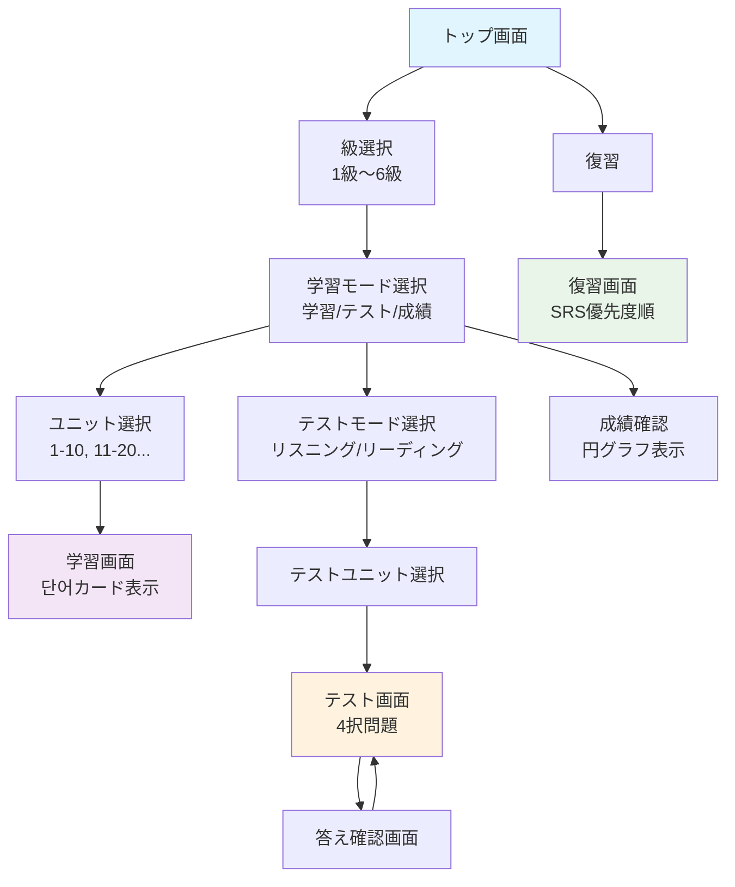
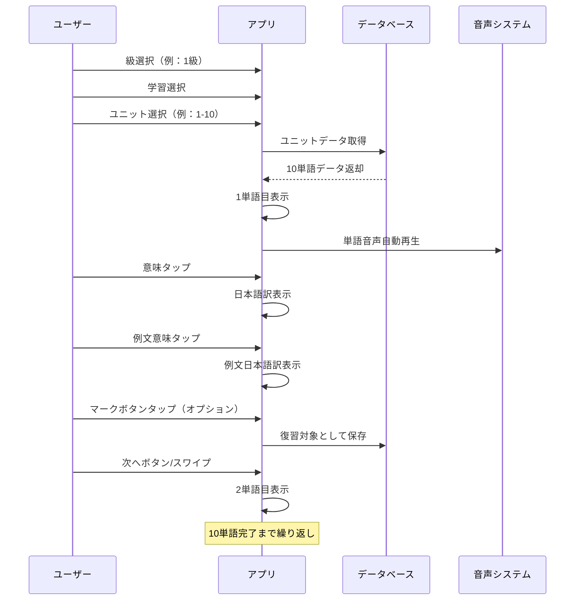
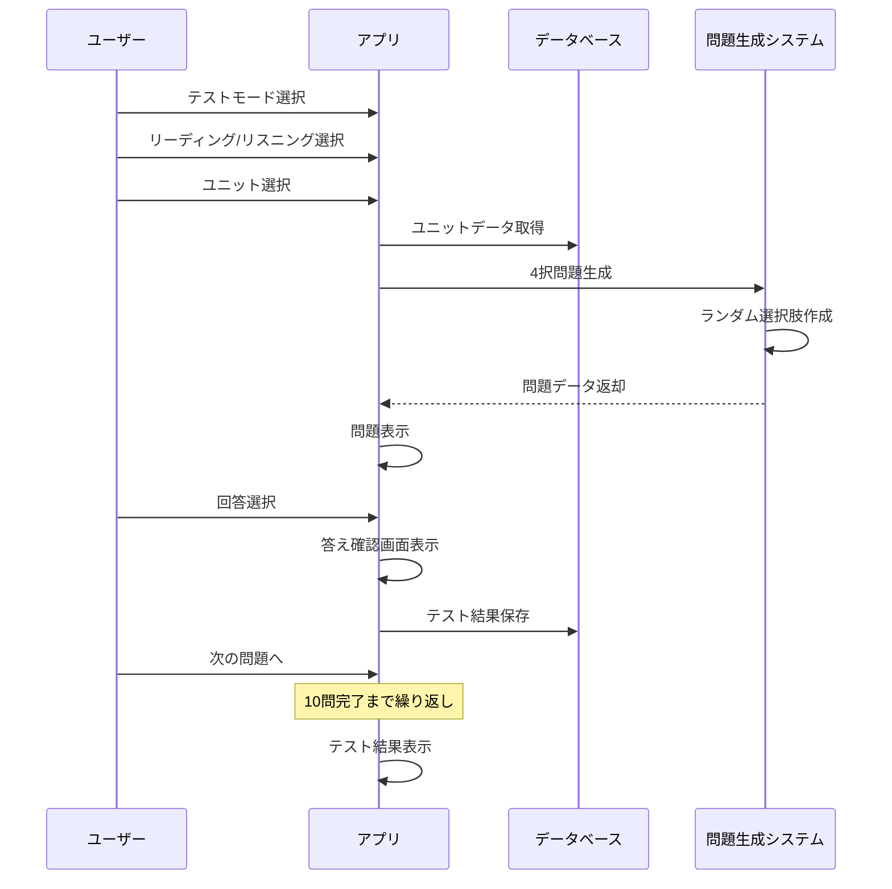
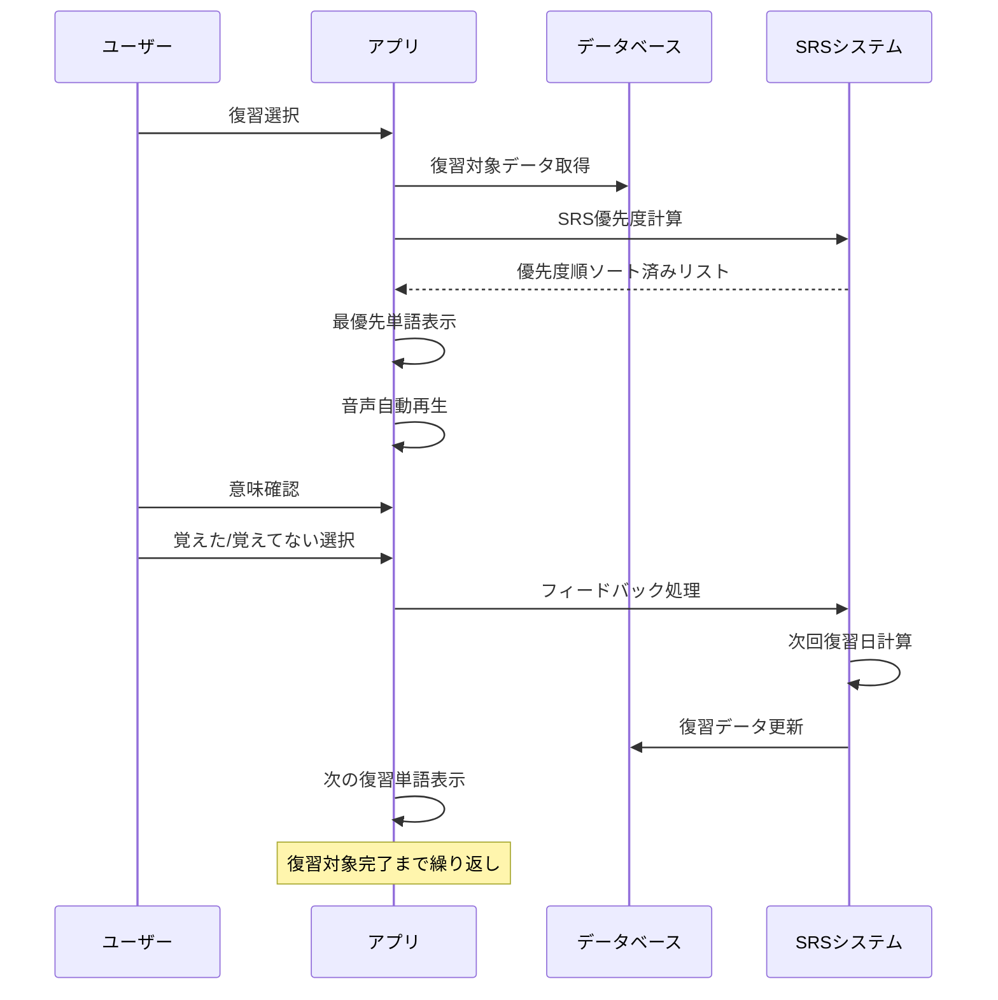

# 画面遷移・シーケンス設計

## 全体画面フロー

## 詳細シーケンス

### 1. 学習モードシーケンス

### 2. テストモードシーケンス

### 3. 復習モードシーケンス

## 戻るボタン・ナビゲーション仕様

### 戻るボタン動作
- **学習画面**: ユニット選択へ
- **テスト画面**: テストユニット選択へ  
- **復習画面**: トップ画面へ
- **その他**: 直前画面へ

### ホームボタン
- 全画面でトップ画面への直接遷移可能

---
*最終更新: 2025/6/13*